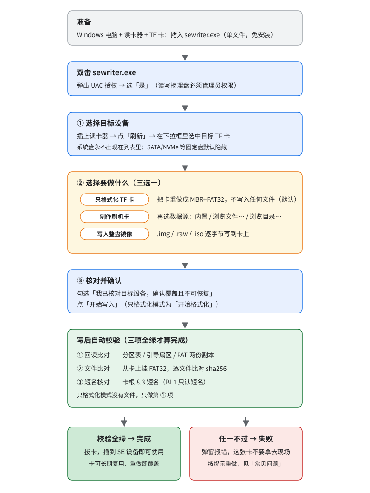

# SE写卡工具 (sewriter)

给现场 / 产线用的 **SE 系列设备（SE5 / SE7 / SE9）TF 卡制作工具**。Windows 单文件绿色程序 ——
拷到机器上双击就能用，不用安装，不依赖运行库。



## 1. 它能做什么

界面上第 ② 步三选一：

| 模式 | 做什么 | 什么时候用 |
|---|---|---|
| **只格式化 TF 卡**（默认） | 把整张卡重做成 MBR + FAT32，不写入任何文件 | 卡插进设备起不来、格式被别的工具改坏了（见 [§5](#5-只格式化-tf-卡)） |
| **制作刷机卡** | 格式化成 MBR + FAT32，再把数据源里的文件写进去 | 做 SE5 / SE7 / SE9 恢复卡 |
| **写入整盘镜像** | 把 `.img` / `.raw` / `.iso`（或其压缩体）逐字节写到卡上 | 整盘镜像烧录 |

- **平台**：Windows 7 及以上。默认交付 32 位 `sewriter.exe`（Win7 32/64 位通用），
  另有 64 位 `sewriter-x64.exe`（体积略小、速度略快）。
- **双击即弹 UAC**：读写物理盘必须管理员权限，授权框选「是」。
- **内置中文字体**：现场有些机器系统字体不全，界面中文会画成一排豆腐块，所以 exe 里直接带了
  一份 Noto Sans CJK SC 子集（SIL OFL 1.1，见 `src/assets/OFL.txt`），启动时注册进本进程，
  不落盘、不改系统。代价是 exe 大约多 3.4 MiB。
- **默认不带内置镜像**：数据源在界面里选。需要「插卡即烧、不用带镜像文件」的版本时，
  见 [§7 自带镜像的 exe](#7-自带镜像的-exe)。

## 2. 完整流程

### 准备

Windows 电脑 + 读卡器 + TF 卡，把 `sewriter.exe` 拷过去。**双击**运行，UAC 授权框选「是」。

### ① 选择目标设备

插上读卡器 → 点「刷新」→ 在下拉框里选中目标 TF 卡。

系统盘永远不会出现在列表里；SATA / NVMe 等固定盘默认隐藏，勾选「全部」并二次确认后才可选。

### ② 选择要做什么

三选一，默认「只格式化 TF 卡」。

- **只格式化 TF 卡**：只把卡做成 MBR + FAT32，不写入任何文件。详见 [§5](#5-只格式化-tf-卡)。
- **制作刷机卡**（做恢复卡用这个）：卡格式化为 MBR + FAT32，再把数据源里的文件写进去。
  数据源三选一 —— **内置**（程序自带发版文件包）、**浏览文件…**（选发版包
  `se7-recovery-files-<版本>.zip`，或任何 `.img` / `.img.gz` / `.txz` / `.tar.zst`…，按内容自动识别）、
  **浏览目录…**（直接选一个目录，内容即卡根目录该有的东西，不必先打包）。
- **写入整盘镜像**：把 `.img` / `.raw` / `.iso`（或其压缩体）逐字节写到卡上。

> 界面上的「高级选项」默认收起：写入方式自动识别、分区按整卡容量建。只有自动识别不准、
> 或想按内容大小建分区时才需要展开 —— **收起时里面两项不生效**。

### ③ 核对并确认

勾选「我已核对目标设备，确认覆盖且不可恢复」→ 点「开始写入」（只格式化模式下按钮是
「开始格式化」）。

### 写后自动校验

写完程序自己做三项校验，**全绿才算完成**：

1. **回读比对**：分区表 / 引导扇区 / FAT 两份副本。
2. **文件比对**：从卡上挂 FAT32，逐文件比对 sha256。
3. **短名核对**：卡根 8.3 短名（原因见 [§4](#4-卡上的-83-短名bl1-只认短名)）。

任一项不过直接弹窗报失败，不会让你拿着一张起不来的卡去现场。只格式化模式没有文件，
只做第 1 项。

## 3. 数据源与写入方式

| 数据源 | 写入方式 | 说明 |
|---|---|---|
| 发版文件包 `.zip` | 文件包 → MBR+FAT32 | **推荐**。只写实际文件，空白区不写；**打开即分析完** |
| 老文件包 `.txz` / `.tar.zst` | 文件包 → MBR+FAT32 | 同样能写，但**分析很慢**（见下方速度表） |
| 目录 | 文件包 → MBR+FAT32 | 与文件包等价，省掉打包步骤 |
| 整卡镜像 `.img` / `.raw` / `.iso` | 整盘镜像 | 逐字节写入（含稀疏写入优化） |
| 上述的 gz/xz/bz2/zst/zip/7z/rar/tar 压缩体 | 按内容自动判定 | 包内是单个镜像 → 整盘；是一批文件 → 建卡 |
| 无（「只格式化 TF 卡」模式） | 只建 MBR+FAT32 | 不写入任何文件 |

### 包格式与速度（重要）

同样是 217 MB 卡内容：

| 格式 | 包大小 | 分析（探测） | 写卡 | 写后文件校验 | 全流程 |
|---|---|---|---|---|---|
| `.zip` | 110 MB | **0.00 s** | 3.5 s | 4.4 s | **8 s** |
| `.txz` | 83 MB | 36.4 s | 36.4 s | 38.8 s | 116 s |

原因：`.txz` 这类顺序压缩流没有索引，要枚举里面有哪些文件就必须把整条流解一遍，
而且**写卡、写后校验各自还要再解一遍**；`.zip` 有中央目录，分析时只读目录区，一个字节都不用解压。

> 结论：**优先用 `.zip` 发版包**。手里只有 `.txz` 时也能正常写卡，只是慢（分析阶段进度条会一直跑）。

### 刷机包根目录自动定位

压缩包 / 目录里若多套了一层（如 `sdbootrecoveryfiles/`），工具会按特征文件（`fip.bin` /
`boot.scr` / `*.itb`）自动找到刷机包那一层，剥掉外层后再写 —— 保证**落到卡根目录的就是刷机包本身**。
存在多个候选目录时不猜，直接报出来让人判断。

### 其他

- **分区大小**：默认按整卡容量建 FAT32（整张卡都能用）；勾「按内容建分区」则只按文件内容
  大小建（更快，卡上剩余空间不属于该分区）。
- **目录源**：软链按目标文件处理；FAT32 放不下的条目（设备文件、断链等）跳过并在界面上计数。

## 4. 卡上的 8.3 短名（BL1 只认短名）

FAT32 上每个文件都有两个名字：长名（`fip.bin`，Windows 里看到的就是它）和 8.3 短名
（`FIP.BIN`）。**SE7 的 BL1 读卡时只认短名** —— 它用的 FatFs 关掉了长名支持（`FF_USE_LFN=0`），
找 `fip.bin` 时匹配的实际是 `FIP     BIN` 这一串。

坑在这里：短名本该只在**同名冲突**或**名字超长 / 含非法字符**时才用 `~N`，一旦被写成
`FIP~1.BIN`，卡上明明有 `fip.bin`，BL1 也找不到 —— 上电串口打印
`NOTICE: fip not found on SD`，然后回退到板载 SPI flash 启动。

工具写卡收尾会自动核对卡根短名，并在日志 / 摘要里给一行结论：

```
✓ 7 个文件全部校验通过 (216.9 MiB, 耗时 4.6s) ｜ BL1: 卡根 fip.bin 短名 FIP.BIN (BL1 可识别)
```

短名不对会直接判校验失败并弹窗。

> 手上的恢复卡如果是用 **2.0.4 之前**的版本写的，请用当前版本重写一遍。

## 5. 只格式化 TF 卡

**什么时候用**：卡插进 SE7 起不来，串口里 BL1 报 `fip not found on SD`，或者干脆认不出卡。
常见原因是卡被别的工具格式化成了 **exFAT / NTFS / GPT**，或者 FAT32 被写坏了 —— SE7 的 BL1 走
FatFs，**只认 MBR + FAT32**，别的格式一律认不出来。这时不必重新下一份发版包，直接格式化回可用状态。

**怎么用**：② 选「只格式化 TF 卡」→ 填卷标（默认 `SE`）→ ③ 勾确认 → 点「开始格式化」。

**它做了什么**：

- 卡头 1 MiB 清零 → 写 MBR 分区表（1 个分区，起始 LBA 2048 = 1 MiB 对齐，类型 `0x0C` = FAT32 LBA）
  → 建 FAT32 文件系统。**不写入任何文件**，卡根目录是空的。
- 与「制作刷机卡」先建的那张卡是**同一种格式**（同一个建卡函数），两种卡可以互换。
- 只写文件系统元数据 + 文件分配表，卡上空白区一个字节都不擦 —— 快（8 GB 卡几秒），
  但**旧数据不会被抹掉**，只是不再属于任何文件。涉密场合请另行擦除。
- 卷标只给人看，不影响设备引导；卡大于 FAT32 上限（2 TiB）时按上限建分区，小于 64 MiB 时报错。

**写后校验**：回读核对 MBR 引导签名 / 分区类型与起始位置 / BPB 关键字段 / FAT 两份副本逐字节一致。
没有文件，所以没有文件级校验。

**格式化完怎么放文件**：直接用资源管理器把刷机包内容拷进卡根目录即可。注意两点：

- 卡根必须是 `fip.bin`、`boot.scr` 这些文件本身，**不要多套一层目录**
  （`sdbootrecoveryfiles/fip.bin` 这样 BL1 找不到）。
- `fip.bin` 的 8.3 短名必须是 `FIP.BIN`。用资源管理器拷贝一般没问题；拷完不放心可以用
  `sewriter.exe write` 重写一遍。

## 6. 命令行（无人值守 / 批处理）

```
sewriter.exe                           图形界面（需管理员权限）
sewriter.exe list [--all]              列出磁盘
sewriter.exe info                      查看内置数据源与磁盘
sewriter.exe write --disk N [--image <包> | --dir <目录>] [--yes] [--no-verify] [--force]
sewriter.exe format --disk N [--label <卷标>] [--yes] [--no-verify] [--force]
sewriter.exe verify --disk N [--image <包> | --dir <目录>]
sewriter.exe hash [--image <包>]
sewriter.exe repack --image <包> [--out <新程序>] [--skeleton <模板程序>] [--force]
```

```bat
sewriter.exe write --disk 3 --yes                                   :: 用内置包写磁盘 3
sewriter.exe write --disk 3 --image se7-recovery-files-1.6.0.zip --yes
sewriter.exe write --disk 3 --dir D:\se7-card --yes                 :: 直接拿目录建卡
sewriter.exe write --disk 3 --image pkg.zip --fs-size auto --yes    :: 只按内容大小建分区
sewriter.exe format --disk 3 --yes                                  :: 只格式化 (卷标默认 SE)
sewriter.exe format --disk 3 --label SE7BOOT --yes                  :: 只格式化 + 指定卷标
sewriter.exe verify --disk 3 --image se7-recovery-files-1.6.0.zip   :: 只校验
```

- `--disk` 收磁盘号，也收设备路径。
- 系统盘永不出现在可选列表；SATA / NVMe 等固定盘默认隐藏，需 `--all` 查看 + `--force` 才可写。
- 写盘前会打印目标磁盘型号 / 容量 / 分区表，需勾选确认（CLI 需 `--yes`）；写盘前强制卸载并
  锁定目标卷（避免「卷被占用 → Access is denied」）。
- 默认写后校验，`--no-verify` 可关（不推荐）。

## 7. 自带镜像的 exe

需要「插卡即烧、不用带镜像文件」时，把文件包追加进程序生成一个自带新包的 exe：
菜单「工具 → 导出自带镜像的新程序…」，命令行等价于 `sewriter.exe repack --image <包>`。
**不需要构建机、不需要 Go 环境。**

## 8. 常见问题

| 现象 | 处理 |
|---|---|
| 双击无反应 / 提示需要权限 | 程序需要管理员权限；若域策略禁止提权，请用管理员身份的 cmd 运行命令行模式 |
| 列表里没有我的卡 | 点「刷新」；仍没有时确认读卡器被系统识别（磁盘管理里能看到） |
| 提示「卷被占用，Access is denied」 | 关掉资源管理器窗口 / 杀毒软件对该盘的扫描后重试（工具已内置强制卸载 + 锁定重试） |
| 写入很慢 | 先看数据源格式：`.zip` 秒开，`.txz` / `.tar.zst` 要整条解压（见 [§3 速度表](#包格式与速度重要)）。写后校验本身也要读一遍，急用可加 `--no-verify`（不推荐） |
| 报「包内没有找到刷机包」 | 该压缩包内容不是卡根目录该有的东西；确认包内有 `fip.bin` / `boot.scr` / `*.itb` |
| 卡插上 SE7 不启动（`fip not found on SD`） | 卡的格式不对或 `fip.bin` 短名不对：先用「只格式化 TF 卡」重做一遍（[§5](#5-只格式化-tf-卡)），再把文件拷回去；拷完仍不行就用「制作刷机卡」整卡重写 |
| 「写入方式」「按内容建分区」找不到 | 它们在「高级选项」里，默认收起（默认就是推荐值：自动识别 + 按整卡建分区） |
| 384 GB 及以上的大卡 | 请用 **2.1.0 及以上**版本制作。更早版本算 FAT32 表大小有缺陷，卡会「看着格式化成功，却挂载失败或一写就坏」 |

## 开发与构建

源码、构建脚本、单元测试与开发注意事项见 [BUILD.md](./BUILD.md)。Go 代码在 `src/`。
